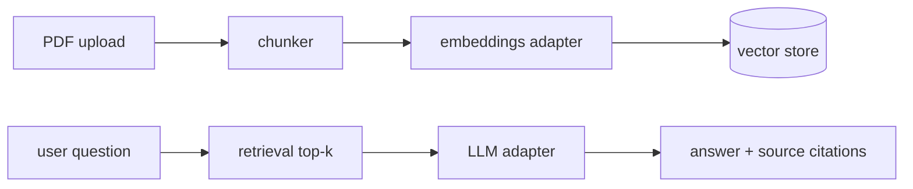

# DocMind — RAG Chat With Your Documents

-brightgreen)


Chat with your PDFs: upload documents, ask questions, get answers **with citations to the
exact source passage** — a lean Retrieval-Augmented Generation app with pluggable
embeddings/LLM providers (works with local llama.cpp or any OpenAI-compatible API).

> 🇧🇷 Converse com seus PDFs: envie documentos, pergunte e receba respostas **com citação
> do trecho exato da fonte** — um app RAG enxuto com provedores de embeddings/LLM
> plugáveis (funciona com llama.cpp local ou qualquer API OpenAI-compatível).

## Why this project matters

RAG is the #1 applied-AI skill hiring managers screen for in 2025-26. DocMind implements
the full loop — ingestion, chunking, embeddings, vector search, grounded answers with
source citations — without hiding behind a big framework.

## Features (roadmap)

- [ ] **M1** — PDF upload → chunking → embeddings (pluggable adapter) → chat with citations
- [ ] **M2** — Multiple documents, persistent conversations, streamed answers
- [ ] **M3** — Ingestion dashboard (status/errors), answer-fidelity test suite, architecture diagram

## Architecture



## Quick start (planned)

```bash
docker compose up   # app + optional local llama.cpp
```

## Built with

- LLM/embeddings adapter pattern proven in my `ai_video_automation` LLM stack
  ([site_corp](https://github.com/FrancosCorporation) private lab)
- Architecture reference: [weaviate/Verba](https://github.com/weaviate/Verba) (BSD-3-Clause)
- Lean PDF-chat reference: [datvodinh/rag-chatbot](https://github.com/datvodinh/rag-chatbot)

## License

MIT — Rodolfo Franco ([FrancosCorporation](https://github.com/FrancosCorporation))

---

### 🇧🇷 Sobre (PT-BR)

Chat RAG com seus documentos: pipeline completo de ingestão, chunking, embeddings,
busca vetorial e respostas fundamentadas com citações de fonte. Provedores plugáveis
(local ou API). Roadmap de 3 milestones no PROJETOS_RH.md do workspace.
